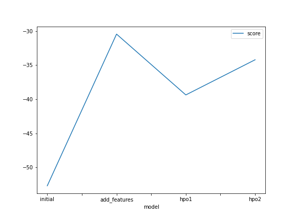
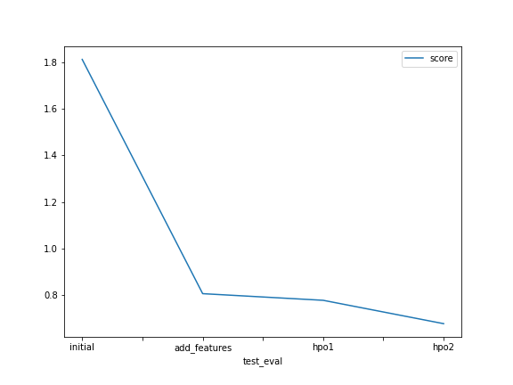

# Report: Predict Bike Sharing Demand with AutoGluon Solution
#### NAME HERE

## Initial Training
### What did you realize when you tried to submit your predictions? What changes were needed to the output of the predictor to submit your results?
We need to specify both the datetime and count

### What was the top ranked model that performed?
Next, there is a list showing the best model for each case
initial case: WeightedEnsemble_L3  
adding features case: WeightedEnsemble_L3  
first hyperparameters tunning: WeightedEnsemble_L2  
second hyperparameters tunning: WeightedEnsemble_L2  

## Exploratory data analysis and feature creation
### What did the exploratory analysis find and how did you add additional features?
The components of the datetime were extracted, for example: the month, day of month, hour
Additionally, the ratio between the "feels like" temperature (atemp) and the hours to 2pm in the same day was computed in order to link the temperature with the time within the day that it is hotter.

### How much better did your model preform after adding additional features and why do you think that is?
It performed a lot better when we added additional features, auto-gluon missinterpreted some variables like season and weather as numeric values insted of categorical. So, when we specifically set those variables as categorical the new model outperformed the first one.

## Hyper parameter tuning
### How much better did your model preform after trying different hyper parameters?
In this case, there was a slight improvement every time I tunned the hyperparameters, we know hyperparameter tunning is one of the most time-spending task when we fit models to our data.

### If you were given more time with this dataset, where do you think you would spend more time?
I think I would spend more time building more features, maybe trying pairwise multiplication and squares or even cubed for each variable.

### Create a table with the models you ran, the hyperparameters modified, and the kaggle score.
|model|hpo1|hpo2|hpo3|hpo4|using_val_data|score|
|--|--|--|--|--|--|--|
|initial|-|-|-|-|False|1.81123|
|add_features|-|-|-|-|False|0.80735|
|hpo1|num_epocs=10|num_boost_round=100|time_limit=1200|num_trials=5|True|0.77891|
|hpo2|num_epocs=50|num_boost_round=200|time_limit=1200|num_trials=10|True|0.67880|

### Create a line plot showing the top model score for the three (or more) training runs during the project.

### Create a line plot showing the top kaggle score for the three (or more) prediction submissions during the project.

## Summary
As you can see, the best model for the metric root_mean_squared_error in the training dataset wasn't the best model for the test data in the kaggle competition. That is because we trained a better and more general model when we tuned the hyperparameters and add the validation dataset to the AutoGluon framework. The model could be trained for better predicting values using unseen data.
